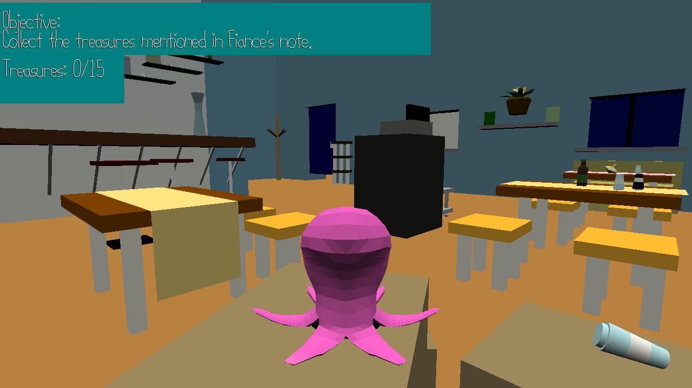

# Broke

Author: Kyle Jannak-Huang, Xinyi Sun, Haidar Jamal

Design: This is a platformer game in which you play as an octopus. You must search for your fiance, who left you with only a note.

Screen Shot:

How To Play:

Controls:

Move with WASD. Look/rotate with mouse motion. 
Jump with space, crouch/slide with left shift. Climb onto ledges with space when mid-jump. 
Zoom camera with scroll wheel.

Sources: All the assets were made by us (so far). Most of the library code was written by Jim McMann.

This game was built with [NEST](NEST.md).

